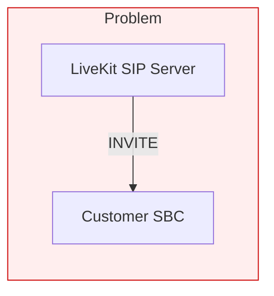
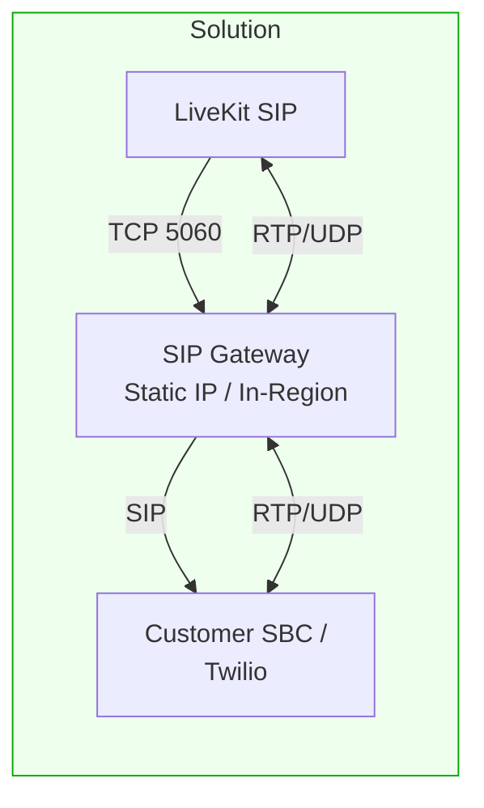
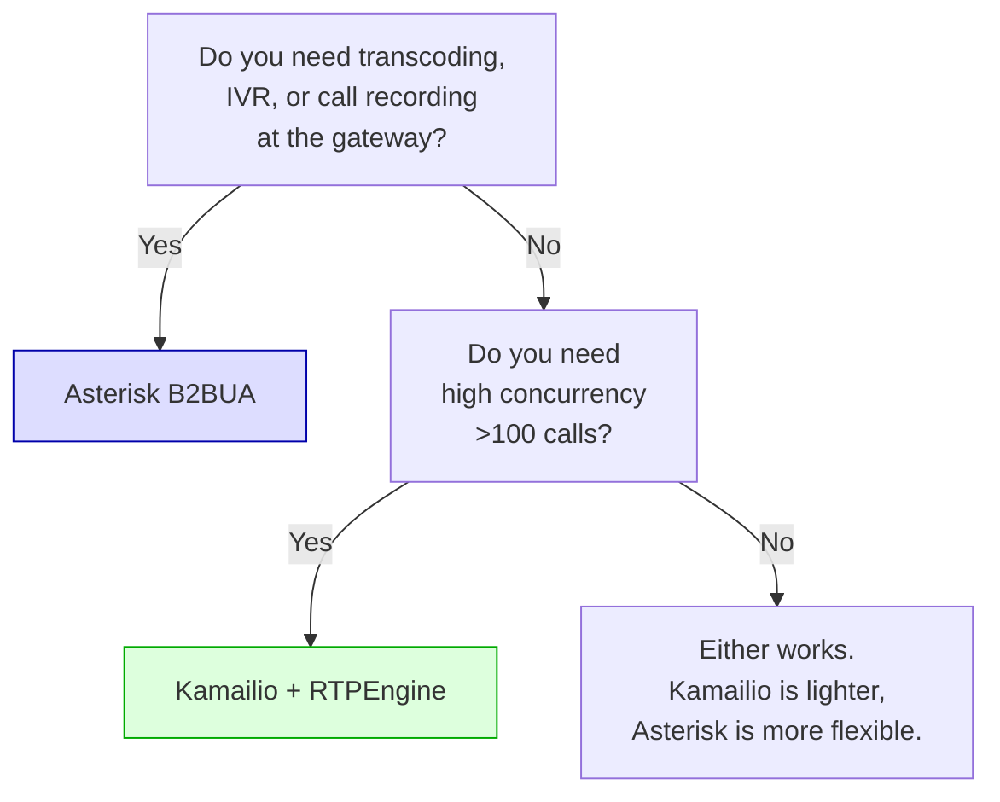
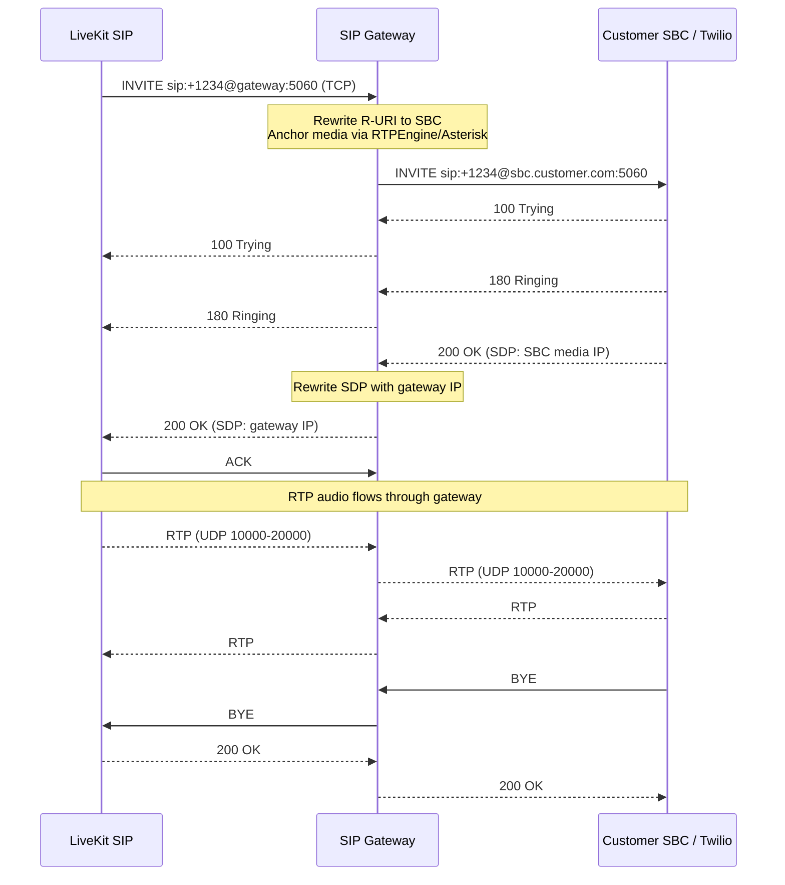

# SIP Gateway

A regional SIP gateway that sits between [ElevenLabs](https://elevenlabs.io) (LiveKit SIP) and a customer's SBC / SIP trunk provider (e.g., Twilio). Two implementations are provided — pick the one that fits your use case.

## Why



- **No static IP** — LiveKit Cloud nodes have no static IP range. Legacy SBCs (Five9, etc.) require IP whitelisting.
- **Regulatory** — Some countries (e.g., Turkey) require SIP INVITEs to originate from within the country.
- **FQDN unsupported** — Some SBCs only accept IP addresses, not hostnames.



The gateway provides a **fixed IP**, **in-region presence**, and **media anchoring** (all RTP flows through it).

## Two Approaches

| | [Kamailio + RTPEngine](./kamailio-proxy/) | [Asterisk B2BUA](./asterisk-b2bua/) |
|---|---|---|
| **Architecture** | Stateful SIP proxy + dedicated media relay | Full Back-to-Back User Agent (PBX) |
| **SIP handling** | Forwards and rewrites headers, preserves Call-ID | Terminates and re-originates both call legs |
| **Media** | RTPEngine: zero-copy RTP forwarding | Asterisk bridge: userspace media mixing |
| **Overhead** | ~2ms per call | ~10-20ms per call |
| **Concurrency** | ~1000+ calls/instance | ~50-100 calls/instance |
| **Header passthrough** | Automatic (all headers forwarded) | Explicit (must map each custom header in dialplan) |
| **Codec transcoding** | No (passthrough only) | Yes (can transcode between codecs) |
| **IVR / call logic** | No | Yes (dialplan, DTMF, recording, etc.) |
| **Config complexity** | ~150 lines of `kamailio.cfg` | ~200 lines of Asterisk PJSIP + dialplan |
| **Best for** | Transparent relay, high scale, production | PoC, when you need call logic/transcoding |

### Decision flowchart



## Call Flow



## Deployment Options

### Option 1: GCP (Terraform + gcloud)

Best for: static IP whitelisting, quick PoC, when GCP has a region nearby.

**Kamailio approach:**
```bash
cd kamailio-proxy/terraform
cp terraform.tfvars.example terraform.tfvars  # edit region
terraform init && terraform apply

cd ../scripts
./deploy.sh --customer-sbc sbc.customer.com
```

**Asterisk approach:**
```bash
cd asterisk-b2bua
PROJECT_ID=xi-playground \
TWILIO_TERMINATION_HOST="your-trunk.pstn.twilio.com" \
bash deploy-gcp-middleware.sh
```

See each folder's README for full GCP instructions.

### Option 2: On-Prem / Non-GCP (Turkey, etc.)

Best for: in-country regulatory compliance, GCP not available in region.

**Kamailio approach:**
```bash
sudo bash kamailio-proxy/scripts/install-onprem.sh \
    --external-ip <PUBLIC_IP> \
    --internal-ip <PRIVATE_IP> \
    --customer-sbc sbc.customer.com
```

**Asterisk approach:**
```bash
sudo bash asterisk-b2bua/install-onprem.sh \
    --twilio-termination-host your-trunk.pstn.twilio.com \
    --external-ip <PUBLIC_IP>
```

Both scripts:
- Install Docker if missing (Debian/Ubuntu/CentOS)
- Write all config files
- Open firewall ports
- Build and start the stack
- Print what to configure on the ElevenLabs side

### Requirements

| Resource | Minimum |
|----------|---------|
| OS | Ubuntu 22.04+, Debian 12+, CentOS 8+ |
| CPU | 2 cores |
| RAM | 2 GB |
| Ports | TCP 5060, UDP 5060, UDP 10000-20000 |
| IP | Static public IP (or NAT with port forwarding) |

## ElevenLabs Configuration

After deploying either approach, configure the ElevenLabs outbound trunk:

| Field | Value |
|-------|-------|
| **Address** | `<gateway-public-ip>` |
| **Transport** | `TCP` |
| **Auth** | Username/password if enabled on gateway |

## Twilio Elastic SIP Configuration

### Termination (ElevenLabs → Gateway → Twilio → PSTN)

1. In Twilio Console → Elastic SIP Trunking → your trunk → **Termination**
2. Under **Authentication → IP Access Control Lists**, add `<gateway-ip>/32`

### Origination (PSTN → Twilio → Gateway → ElevenLabs)

1. In Twilio Console → your trunk → **Origination**
2. Add URI: `sip:<gateway-ip>:5060;transport=tcp`

## Folder Structure

```
sip-gateway/
├── README.md                          # This file
├── kamailio-proxy/                    # Kamailio + RTPEngine approach
│   ├── README.md
│   ├── docker/
│   │   ├── docker-compose.yml
│   │   ├── .env.example
│   │   ├── kamailio/
│   │   │   ├── Dockerfile
│   │   │   ├── kamailio.cfg
│   │   │   └── entrypoint.sh
│   │   └── rtpengine/
│   │       └── Dockerfile
│   ├── terraform/
│   │   ├── main.tf
│   │   ├── variables.tf
│   │   ├── outputs.tf
│   │   └── terraform.tfvars.example
│   └── scripts/
│       ├── deploy.sh
│       ├── install-onprem.sh
│       ├── startup.sh
│       └── test-sip.sh
└── asterisk-b2bua/                    # Asterisk B2BUA approach
    ├── README.md
    ├── deploy-gcp-middleware.sh
    ├── startup-script.sh
    ├── install-onprem.sh
    └── onprem.env.example
```
